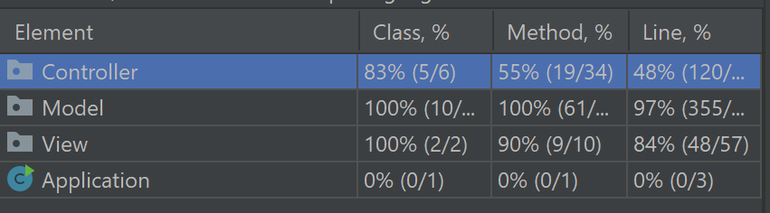

## LDTS<10><8> - TETRIS

Este jogo é uma implementação fiel em java, do clássico Tetris, com o objetivo de encaixar peças, que descem ao longo da tela,  de diferentes formatos, capazes de girar sobre o próprio eixo em apenas quatro posições. Um jogador aumenta a sua pontuação ao completar uma linha, que desaparece ao ser completada e a linha superior desce ocupando a sua posição.

O projeto foi desenvolvido por *Adam Nogueira* (up202007519@fe.up.pt), *Ana Sofia Costa* (up202007602@fe.up.pt) e *Inês Oliveira* (up202103343@fe.up.pt).

### CARACTERÍSTICAS IMPLEMENTADAS

**Rodar as peças:** O utilizador do jogo deve usar as setas do teclado para girar as peças que descem.

**Completar linhas:** Ao completar uma linha, esta desaparece e a linha de cima ocupa a sua posição.

**Velocidade da peça:** As peças descem a uma velocidade constante. No entanto, o jogador pode acelerá-la usando a seta para baixo do teclado.

**Guardar uma peça:** O jogador pode guardar uma peça e jogar novamente com a peça anteriormente guardada carregando na tecla C. Se ainda nao tiver nenhuma peça guardada, avança para a próxima.

**Drop instantâneo:** O jogador pode descer uma peça ao máximo possível ao pressionar a barra de espaço.

**Ver as próximas peças:** Durante o jogo é possível ver as 4 peças que serão jogadas a seguir.

**Menu:** Quando o jogo é iniciado, aparece o Menu. O jogador tem  três diferentes opções. Ao selecionar a letra "S" do teclado o jogo irá ser inicializado. 

**Instruções:** No menu inicial, caso o jogador queira ter acesso às instruções do jogo, pode selecionar a letra "I" e irá ser disponibilizado um menu de instruções.

**Sair do jogo:** A qualquer momento do programa o utilizador tem a possibilidade de carregar na tecla "Q" para sair instantaneamente do jogo.

**Pontos ao completar linhas:** Ao completar uma linha o jogador aumenta a sua pontuação. Se completar mais do que uma linha, de uma so vez, a pontuação será maior.

**Pontuações:** Valores base : 1 linha = 40 pontos, 2 linhas = 100 pontos, 3 linhas = 300 pontos, 4 linhas = 1200 pontos; A pontuação será valor base*nível, com bónus de 50% caso complete linhas com peças seguidas.

**Diferentes níveis:** À medida que o jogador vai ganhando pontos, os níveis vão aumentando, consequentemente a velocidade com que a peça desce também irá aumentar. O nível que o utlizador se encontra é indicado na tela.

**Game over:** Se o jogador deixar que as peças chegam ao topo da tela, perde e o jogo termina. Na tela irão ser revelados os pontos finais e o nível em que o jogador se encontrava.

**Nova tentiva:** No final do jogo, após perder o jogador tem a oportunidade de selecionar a opção para reiniciar o jogo.

| Menu | Game Over |
|:----------:|:---------:|
|  |  |

### CARACTERÍSTICAS POR IMPLEMENTAR

No final do projeto, surgiu a ideia de implementar um leaderboard, algo que não foi possível ser criado visto que já não podiam ser feitas modificações no código.

### DESIGN

> Pattern: Model-View-Controller (MVC)

**Problema no contexto:** Implementamos este design pattern de modo a manter a view, model e controller independentes uns dos outros, separando as responsabilidades de cada um e para a melhor organização do código.

**Pattern:** A design pattern escolhida divide-se nas seguintes secções:

- [Model](../src/main/java/g1008.Model.java): Representa a data.

- [View](../src/main/java/g1008.View.java): Exibe os dados do modelo e envia as ações do utilizador ao controlador.

- [Controller](../src/main/java/g1008.Controller.java): O controlador atualiza a visualização sempre que os dados mudam e interpreta as acções do utilizador.

**Implementação:**

**Consequências:** O código tornou-se mais fácil de modificar, devido à sua organização em secção. Com esta separação, o código pode ser melhor testado.

> Composite pattern

**Problema no contexto:** Implementamos este design pattern de modo a que vários objetos diferentes pudessem partilhar os mesmos atributos e métodos.

I) [Classe Piece](../src/main/java/g1008.Model/Pieces/Piece.java):
- Contém todos os atributos e métodos de uma peça genérica do jogo.
- Subclasses - representam as diferentes peças no jogo, sendo assim extensões da classe principal :
    - [IPiece](../src/main/java/g1008.Model/Pieces/IPiece.java);
    - [JPiece](../src/main/java/g1008.Model/Pieces/JPiece.java);
    - [LPiece](../src/main/java/g1008.Model/Pieces/LPiece.java);
    - [OPiece](../src/main/java/g1008.Model/Pieces/OPiece.java);
    - [SPiece](../src/main/java/g1008.Model/Pieces/SPiece.java);
    - [TPiece](../src/main/java/g1008.Model/Pieces/TPiece.java);
    - [ZPiece](../src/main/java/g1008.Model/Pieces/ZPiece.java).

**Implementação:**

II) [Classe Menu](../src/main/java/g1008.Controller/Menus/Menu.java):
- Contém todos os atributos e métodos de um menu genérico do jogo.
- Subclasses - representam as diferentes menus do jogo, sendo assim extensões da classe principal :
    - [StartMenu](../src/main/java/g1008.Controller/Menus/Menu.java);
    - [InstructionsMenu](../src/main/java/g1008.Controller/Menus/Menu.java);
    - [StartMenu](../src/main/java/g1008.Controller/Menus/Menu.java).

**Implementação:**

**Consequências:** Permite criar classes diferentes com caracrísticas semalhantes, sem a necessidade de repetição de código.

> Facade pattern

**Problema no contexto:** Com o objetivo de implentar funcionalidades no jogo como a música e o desenho de todos os objetos na tela, foi necessário recorrer á interação com objetos de outras classes.

Para desenvolver estas interações foram criadas classes específicas:

I) [Classe MusicPlayer](../src/main/java/g1008.View/MusicPlayer.java) :
- Esta classe realiza toda a interação do jogo com as classes AudioInputStream e Clip. Nos seus métodos são chamados méstodos dos objetos destas classes, que irão ser posteriormente chamados no Game apenas a partir de um objeto da Classe MusicPlayer. 

II) [Classe Painter](../src/main/java/g1008.View/Painter.java) :
- Todas os métodos da Classe TextGraphics que são utilizados no ãmbito do jogo, são chamadas através de métodos da Classe Painter. Apesar do objeto da classe TextGraphics ser criado na classe Game, a interação é concretizada pela classe Painter.

**Implementação:**

**Consequências:** Permite simplificar a interação da classe principal (classe Game) com objetos de outras classes.

### DATA CLASS
Não foi implementada nenhuma classe que não contenha métodos próprios.

### CODE SMELLS RESOLVIDOS

#### **Long Method**
Inicialmente, ao desenvolver as diferentes classes do jogo, acabaram por ser implementados métodos com uma grande quantidade de linhas. Com o objetivo de contornar este problema e melhorar a legibilidade do código, foram criados outros métodos dentro das classes que executariam cada parte específica do método inicial. E assim, o método passaria a chamar outros métodos, em vez de executar as diversas tarefas. Exemplo : Na classe Piece foram criados os métodos checkRight, checkLeft e checkUnder que são chamados no método checkIfFits.   

#### **Dead code**
Com o intuíto de criar uma implentação para o tetris, além das classes que estão implementadas no código, foi também criada a classe Color, que representaria as diferentes cores que são apresentadas na tela do jogo. Com o progresso do projeto, esta classe acabou por ser apagada visto que tinha pouca ou zero interação com o resto da interface, tornado-se assim código morto.

### CODE SMELLS EXISTENTES

#### **Large Class**
A classe Game contem vários métodos, tornando-se assim uma classe extensa. Tendo em conta que é a classe principal do programa, necessita de guardar uma grande quantidade de dados e de ter vários métodos para implementar a interface do jogo, achamos que não haveria sentido em dividir esta classe.

#### **Switch Statements**
Ao longo do código foram utilizados declarações de switch/ifs, para facilitar a tomada de diferentes rumos ao logo do programa. Apesar destas declarações seram utilizadas algumes vezes em diferentes classes, estas foram implementadas de forma simples, não havendo, assim, razão para modificá-las.

#### **Duplicate Code**
À medida que este code smell foi se realçando em alguns métodos das diferentes classes, foram criados outros métodos (alguns estáticos) substituíndo a repetição de código. Apesar disso, este code smell ainda pode ser verificado nas diferentes subclasses de Piece, algo para o qual não foi encontrado remediação, visto que centra-se na criação da matriz de cada diferente tipo de peça.

### TESTING
- Screenshot of coverage report:

NOTA: A falta de testes na classe Game, deve-se ao facto da criação do terminal do jogo ter sido implentada no seu construtor. Esta decisão levou a que qualquer teste criado para a classe Game, implicasse a criação de um terminal. Este fator impossibilita a criação de Mocks que são necessários para testar a classe Game, bvisto que não foram criados getters para a mesma.

- Link dos mutations test:
  http://localhost:63342/projldts/build/reports/pitest/202201211531/index.html?_ijt=lfu7gpd4u8t1btrorngjd1btp7&_ij_reload=RELOAD_ON_SAVE
NOTA: No código, foram implementados testes para a Classe Game que impediam o funcionamento do PIT. Estes foram portanto excluídos do alcance do PIT.

### SELF-EVALUATION
- Adam Nogueira: 33%
- Ana Sofia Costa: 33%
- Inês Oliveira: 33%

